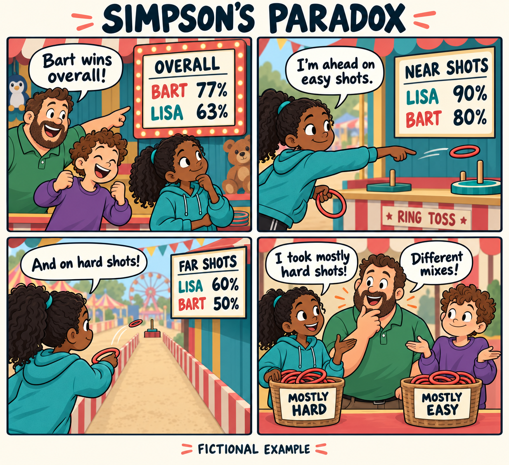

::: {.blog1}

::: {.opening-question}
**Lisa is more accurate than Bart at every distance. So how does Bart finish with the higher success rate?**
:::

At the Springfield carnival, Homer declares Bart the ring-toss champion: he lands 77% of his shots, against Lisa's 63%. Lisa objects. She did better from both the near line and the far line. Surely winning in every category means winning overall?

That intuition feels compelling because we silently imagine the same mix of categories. Here, the mixes differ. This is **Simpson's paradox**: an association points one way within every group but reverses when the groups are combined. The name refers to statistician Edward H. Simpson, whose [1951 paper](https://rss.onlinelibrary.wiley.com/doi/10.1111/j.2517-6161.1951.tb00088.x) examined the interpretation of grouped data. The cartoon family is our teaching cast.

{#fig-comic fig-alt="Four-panel comic with original characters: Bart wins overall, 77% to Lisa's 63%. Lisa leads at near shots, 90% to 80%, and far shots, 60% to 50%. She explains that she took mostly hard shots."}

## The scoreboard is correct

Suppose each sibling takes 100 shots. Lisa chooses mostly the harder, far-distance throws; Bart mostly the easier, near-distance ones. Here are the **invented teaching data**, with successes divided by attempts:



Lisa leads by **10 percentage points at each distance**, yet Bart leads by 14 points overall. No observations disappeared. The grouped and overall comparisons use exactly the same observations.

The key is the denominator. Lisa's impressive 90% near-shot rate describes only ten attempts. Her 60% far-shot rate describes ninety. Bart's easier shots receive most of the weight in his overall rate; Lisa's harder shots receive most of the weight in hers.

## An average has a recipe

Think of the overall rate as a mixture. Each distance supplies a success rate; its share of attempts determines how much of that rate goes into the mixture:

$$
\begin{aligned}
\text{Lisa: }& 0.10\times90\%+0.90\times60\%=63\%\\
\text{Bart: }& 0.90\times80\%+0.10\times50\%=77\%.
\end{aligned}
$$

Each overall rate lies between that player's two distance-specific rates. Lisa's is pulled toward 60%; Bart's toward 80%. Our intuition compares the rates but overlooks their different weights. Averaging the two percentages equally would describe a different mix of shots.

## Change the mix, watch the winner flip

Move the sliders below. Each player's accuracy at each distance stays fixed; only the near-versus-far share changes. Try **Same mix: 50 / 50**. Lisa's standardized rate becomes 75% and Bart's 65%.

```{=html}
<section class="mix-lab" aria-labelledby="mix-heading">
  <div class="lab-kicker">TRY IT YOURSELF</div>
  <h3 id="mix-heading">Same accuracy. Different scoreboard.</h3>
  <p class="lab-help">Change the share of easier, near-distance shots. The remainder are harder, far-distance shots.</p>
  <div class="mix-controls">
    <div class="player-control lisa">
      <label for="lisa-share">Lisa <span id="lisa-mix">10% near · 90% far</span></label>
      <input id="lisa-share" type="range" min="0" max="100" step="1" value="10" aria-describedby="lisa-fixed" disabled>
      <p id="lisa-fixed">Accuracy stays: near 90% · far 60%</p>
    </div>
    <div class="player-control bart">
      <label for="bart-share">Bart <span id="bart-mix">90% near · 10% far</span></label>
      <input id="bart-share" type="range" min="0" max="100" step="1" value="90" aria-describedby="bart-fixed" disabled>
      <p id="bart-fixed">Accuracy stays: near 80% · far 50%</p>
    </div>
  </div>
  <div class="lab-buttons">
    <button type="button" id="equal-mix" disabled>Same mix: 50 / 50</button>
    <button type="button" id="original-mix" class="secondary" disabled>Original carnival</button>
  </div>
  <div class="scoreboard" role="group" aria-label="Weighted overall success rates">
    <div class="score-row"><span>Lisa</span><div class="score-track"><div id="lisa-bar" class="score-bar lisa-bar" style="width:63%"></div></div><output id="lisa-score" for="lisa-share">63%</output></div>
    <div class="score-row"><span>Bart</span><div class="score-track"><div id="bart-bar" class="score-bar bart-bar" style="width:77%"></div></div><output id="bart-score" for="bart-share">77%</output></div>
    <div class="score-axis" aria-hidden="true"><span>0%</span><span>Overall success rate</span><span>100%</span></div>
  </div>
  <p id="mix-verdict" class="mix-verdict" role="status" aria-live="polite">Bart leads overall by 14 percentage points, although Lisa leads at both distances.</p>
  <p class="lab-note">Reweighting illustration: the original counts above stay unchanged. These mixtures hold observed within-distance rates fixed; they are not predictions of new throws.</p>
  <noscript><p>Enable JavaScript to adjust the mix. At a shared 50% near / 50% far mix: Lisa 75%, Bart 65%.</p></noscript>
</section>
```

With any shared mix, Lisa retains her ten-point advantage: each ingredient in her average is ten points higher. The reversal needs different weights. Standardization makes the composition comparable, holding the observed rates fixed; it does not guarantee how either sibling would perform in another game.

## Which answer should Homer use?

For **who landed a larger share of their actual throws**, the overall scoreboard answers correctly: Bart. For **who had the higher observed accuracy at the same distance**, the grouped table answers: Lisa. Different questions justify different summaries.

This matters beyond a carnival. Imagine evaluating job-training programs by employment rates. A program serving mostly job seekers who face greater barriers could have a lower overall placement rate even while its participants do better within each comparable group. Ranking programs from the headline percentage alone could punish the one serving the harder cases. This is a possible pattern, not evidence about any particular program.

But splitting data into groups is no automatic cure. To ask whether a program **causes** better outcomes, we need to understand how people enter it and which variables should be adjusted for. Grouping on a consequence of participation can even remove part of the effect we want to measure. As [Pearl (2014)](https://ftp.cs.ucla.edu/pub/stat_ser/r414.pdf) explains, causal interpretation requires knowledge of the process behind the data, beyond the table. Lisa's table demonstrates an arithmetic reversal, not proof of innate skill or a causal effect.

::: {.takeaway}
**Before trusting an average, ask what went into it.** Check the group rates, check the group sizes, and decide which comparison answers your question. Homer counted the successes correctly. He just needed to look at the recipe.
:::

<details class="reproduce-details">
<summary>Data, sources, and reproduce it</summary>

All four counts are constructed for this explanation; they are not observations from a television episode or an empirical study. The comic was made with OpenAI's built-in image generation tool and checked against the table. Its [generation prompt](artwork-prompt.txt) is included.

Download the [four-row dataset](data/ring_toss.csv), [Python reproduction script](code/reproduce.py), [calculated results](results/summary.json), or [replication instructions](README.md). Run the script with Python 3 from this post's folder; it generates the table and results using the standard library. The interactive demonstration implements the same weighted averages in JavaScript. AI-generated artwork is supplied as an asset; rerunning the analysis does not regenerate it.

```bash
python code/reproduce.py
```

Further reading:

- Simpson, E. H. (1951). [The Interpretation of Interaction in Contingency Tables](https://rss.onlinelibrary.wiley.com/doi/10.1111/j.2517-6161.1951.tb00088.x). *Journal of the Royal Statistical Society: Series B*, 13(2), 238–241.
- Pearl, J. (2014). [Comment: Understanding Simpson's Paradox](https://ftp.cs.ucla.edu/pub/stat_ser/r414.pdf). *The American Statistician*, 68(1), 8–13. Linked version: UCLA author manuscript.

</details>

:::
