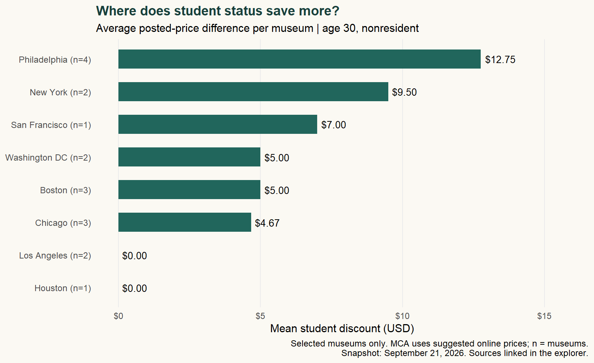
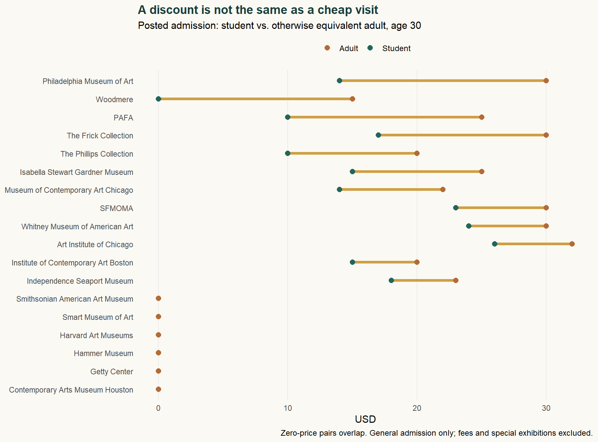

```{r}
invisible(capture.output(source('analyze.R',local=TRUE)))
usd <- function(x) sprintf('$%.2f',x)
ph <- subset(city,city=='Philadelphia')
ny <- subset(city,city=='New York')
ne <- subset(region,region=='Northeast')
```

::: {.story-deck}
<span class="eyebrow">BLOG 2 · DATA IN EVERYDAY LIFE</span>

**A student ID can cut a museum bill. But sometimes the best ticket is free for everyone.**

18 museums · 8 cities · 4 Census regions · September 21, 2026 snapshot
:::

## One card, two questions

Planning a museum weekend raises a familiar student-budget question: how far can an ID card stretch? Starting in Philadelphia, I expanded the search to New York, Boston, Chicago, Washington, San Francisco, Los Angeles, and Houston. I wanted to distinguish **where student status saves the most** from **where admission costs the least**. Those questions sound interchangeable. They are not.

## Building a comparable ticket

I screened 30 institutions and retained `r nrow(d)` with extractable, comparable prices across `r nrow(city)` cities. This is a convenience sample, mostly art museums, not a representative survey. One institution contributes one observation; multiple buildings and repeated daily price tables do not become extra museums.

The baseline compares a **30-year-old, nonresident, full-time college student with valid ID** against an otherwise equivalent nonstudent. Age 30 separates student status from youth eligibility; a second view uses age 22. Penn-specific partnerships, resident discounts, memberships, transportation, parking, booking fees, and separately ticketed exhibitions are excluded. Results describe posted general-admission prices, not a complete travel budget.

**Student-ID saving = comparable adult price − student price.**

Using R's **rvest**, I parsed cached official HTML with `read_html()`, `html_elements()`, and `html_text2()`. Site-specific category patterns distinguish student tickets from parking charges and nonresident rates from local offers. Missing categories stop the analysis; missing prices never become zero. Short evidence extracts, source URLs, collection logs, and scripts accompany the cleaned data.

Requests were spaced and cached. Access refusals, rate limits, robot exclusions, and challenge pages were not bypassed. Barnes and The Broad were dropped after reviewing restrictive terms. This matters statistically: websites that are easier to read can become overrepresented.

## Where the card saves more



Philadelphia leads this sample at **`r usd(ph$saving)` per museum**, compared with **`r usd(ny$saving)`** in New York. Visiting all four sampled Philadelphia institutions once would cost **`r usd(sum(d$student[d$city=='Philadelphia']))`** using student rates, versus **`r usd(sum(d$adult[d$city=='Philadelphia']))`** at adult rates. This is a basket calculation, not a one-day itinerary.

Regionally, I average city means so cities with more observations do not automatically receive more weight. The Northeast has the highest observed mean, **`r usd(ne$saving)`**. However, the Midwest contains only Chicago; Houston and San Francisco each have one museum. These numbers cannot establish which entire U.S. region offers students the best value.

```{r}
tab <- region[,c('region','cities','museums','saving')]
tab$saving <- usd(tab$saving)
knitr::kable(tab,row.names=FALSE,col.names=c('Region','Cities','Museums','Mean saving per city'),caption='Descriptive regional comparison; equal weight per sampled city.')
```

## A larger discount can still mean a larger bill



The Getty Center and Hammer charge neither group for general admission. Their student-ID saving is zero, yet they are inexpensive choices. The [Getty requires a timed reservation](https://www.getty.edu/visit/center/); [Hammer does not require one for individual visits](https://hammer.ucla.edu/visit). Free admission does not remove parking costs or guarantee unrestricted access.

Eligibility changes the story too. At the [Whitney](https://whitney.org/visit), visitors 25 and under enter free regardless of enrollment. Switching both comparison groups to age 22 reduces New York's mean student-ID saving from **`r usd(ny$saving)` to `r usd(ny$saving22)`**. Crediting the entire adult ticket to student status would exaggerate the card's value.

The [MCA Chicago](https://mcachicago.org/visit/) has posted online prices and in-person pay-what-you-can admission. Its listed discount is not a guaranteed reduction in what someone must pay. Excluding MCA gives Chicago a mean saving of **`r usd(mean(d$saving[d$city=='Chicago' & d$id!='mca']))`**. Restricting the comparison to museums with positive adult prices also changes Boston's mean from **`r usd(city$saving[city$city=='Boston'])` to `r usd(city$paid_only[city$city=='Boston'])`**. The denominator matters.

## Plan around eligibility, then the calendar

My practical rule: choose the museums first, check age and student eligibility second, then compare free hours. [Woodmere offers free Sundays](https://woodmeremuseum.org/visit), while [ICA Boston's free Thursday evenings require advance tickets](https://www.icaboston.org/visit/). These are calendar savings available beyond students. Keep pay-what-you-wish separate from guaranteed free admission, and confirm hours at the official links before traveling.

## Explore the admission snapshot

Choose a city and an age scenario. Prices exclude fees; conditions remain visible. “Saving” refers only to student status. **These are September 2026 observations, not live ticket quotes.**

```{=html}

```

## Reproduce the analysis

[Download the data](data/derived/museum_prices.csv){.btn .btn-outline-primary}
[Download the research bundle](research.zip){.btn .btn-outline-primary}
[View the source on GitHub](https://github.com/lizzyuan77/lizzyuan-s-website/tree/main/blog/posts/post2){.btn .btn-outline-primary}

The bundle includes an offline R replay, extraction rules, short factual evidence, acquisition code, exclusions, and package versions. Full museum pages and artwork are not republished. Hours and reservation notes are manually reviewed annotations, not outputs of the price parser. The linked README explains the limitations and refresh procedure.

::: {.callout-note collapse="true"}
## A small, auditable rvest example

```{r}
#| echo: true
rvest::read_html('data/evidence/pma.html') |>
  rvest::html_elements('p') |>
  rvest::html_text2()
```

This reads the short factual extracts retained from the original page. `analyze.R` can also parse the original private HTML cache with `--raw`, using the same category patterns. The public extracts are not presented as full archival copies of the websites.
:::

*AI assistance was used for coding, drafting, and checking extraction rules. Prices are grounded in the linked official pages; the limitations above remain part of the result.*
