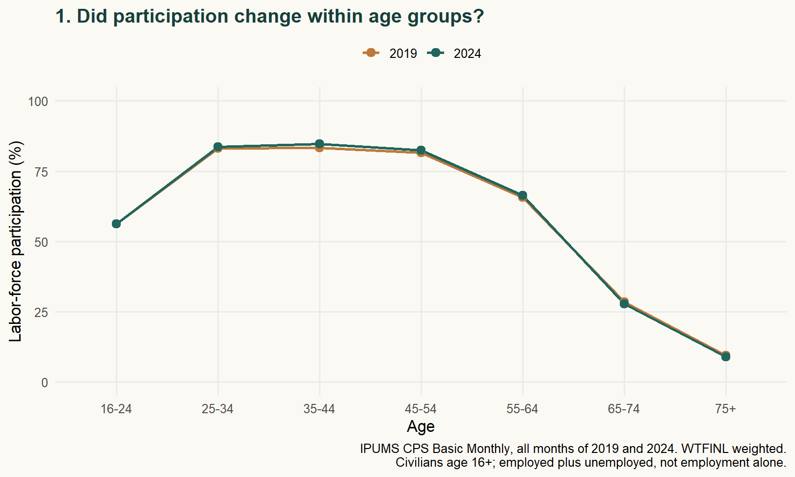
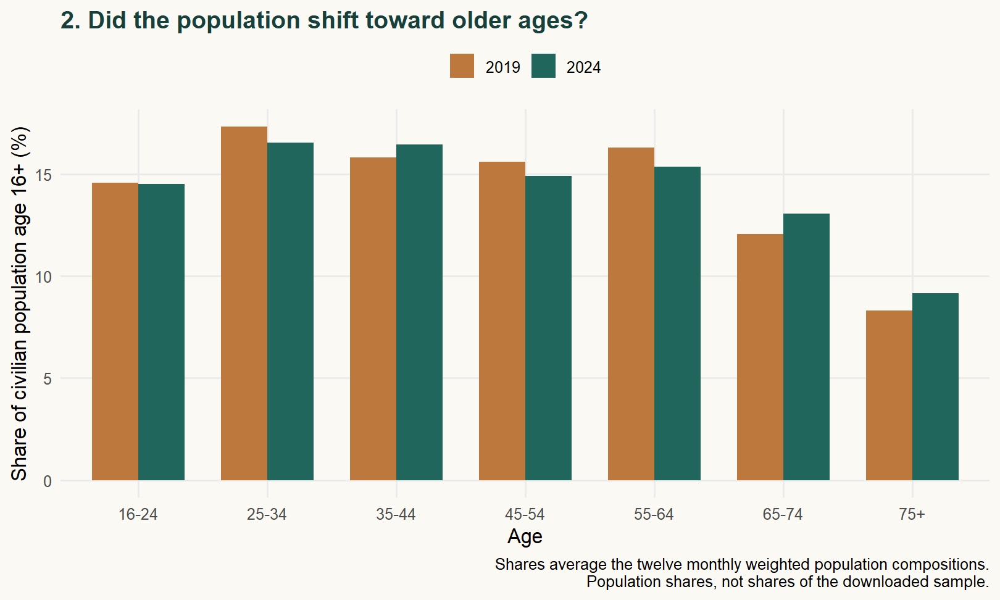
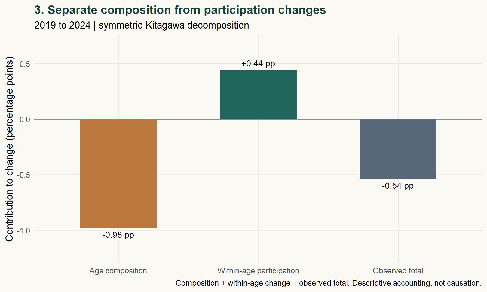

```{r}
r <- readRDS('results/analysis.rds')
pct <- function(x) sprintf('%.2f%%',100*x)
pp <- function(x) sprintf('%.2f',x)
```

::: {.callout-note}
**BLOG 3 · THE PEOPLE BEHIND THE AVERAGE**

Participation fell **0.54 percentage points**. A shift toward older ages pulled it down; changes within age groups partly offset that decline.
:::

## Participation and population aging

A decline in labor-force participation can reflect changes in participation within age groups, changes in the population's age distribution, or both. The distinction matters when interpreting the post-pandemic labor market: an older population can have a lower participation rate even if participation rises among younger adults. I use CPS data to measure how much each component contributes to the change between 2019 and 2024.

Using IPUMS CPS microdata, I compare 2019, before the pandemic, with 2024. The weighted annual participation rate fell from **`r pct(r$annual$rate[1])` to `r pct(r$annual$rate[2])`**. But that average combines two things: how likely people of each age are to participate, and how common each age group is.

## Sample and weights

I use all twelve Basic Monthly CPS samples in each year: **2,611,419 person-month records**, of which **2,115,648** meet the analysis criteria. The population is civilians age 16 or older with a valid labor-force status and positive weight. These are observations, not distinct people; the CPS interviews respondents in multiple months.

Every population statistic uses **WTFINL**, the final person weight. I calculate each month's weighted participation rate, then average the twelve rates equally. Age shares and within-age rates use the same monthly-normalized weights, keeping the decomposition consistent. The code imports the matching DDI metadata so that the weight's implied decimals are handled correctly.

Participation includes employed people **and unemployed people in the labor force**. It is not an employment rate. Someone outside the labor force is not automatically unemployed.

## Compare people of similar ages

Figure 1 compares participation across age groups in each year. Adults aged 25–54 have substantially higher participation rates than those 65 and older. Between 2019 and 2024, participation rose in all five displayed groups below age 65: for ages 35–44, it increased from **83.33% to 84.77%**. Among ages 65–74, it fell from **28.47% to 27.67%**. These are comparisons of age groups in two years; they do not track the same people as they age.

{fig-alt="2019 and 2024 participation by age. Rates rise below age 65 and decline for ages 65–74 and 75+."}

## The changing age distribution

The national participation rate weights each age group's participation rate by its population share. If groups with lower participation account for more of the population, the national rate can fall even with unchanged participation within every age group.

Figure 2 shows this compositional shift. Adults 65 and older increased from **20.40% to 22.23%** of the weighted population. Because their participation rates are relatively low, that shift puts downward pressure on the national average. These are population shares estimated with weights, not percentages of downloaded rows.

{fig-alt="Weighted population shares by age: ages 65–74 increase from 12.08% to 13.05%, and ages 75+ from 8.32% to 9.18%."}

## Separate the two changes

A symmetric Kitagawa decomposition splits the observed change into an **age-composition component** and a **within-age participation component**. It averages the two possible orders of changing shares and rates, so neither year gets special treatment.

Figure 3 gives the result: **`r pp(r$composition)` percentage points** from composition, offset by **+`r pp(r$within)` points** from within-age changes, producing the observed **`r pp(r$delta)` points**. The composition component is larger than the net decline because the two components move in opposite directions. A percentage point is a difference between rates, not a percent change.

{fig-alt="Decomposition bars: age composition −0.98, within-age participation +0.44, observed total −0.54 percentage points."}

Using narrower, mostly five-year age groups gives **−1.09 points** for composition and **+0.55** for within-age changes. The magnitudes change, but the interpretation survives.

## What explains the aggregate decline?

In this decomposition, the shift in age composition contributes **`r pp(r$composition)` percentage points**, exceeding the observed **`r pp(abs(r$delta))`-point decline**. Within-age participation changes offset **`r pp(r$within)` points** of that decline. The aggregate therefore understates the improvement within many age groups. These results help explain the national rate, but they do not tell us why participation changed within those groups.

This is descriptive accounting, not a causal estimate of aging or the pandemic. Within-age changes also reflect health, education, family circumstances, and other composition; even the oldest age bin contains aging. Estimates are not seasonally adjusted, population-control revisions can affect comparisons, and repeated respondents rule out treating all rows as independent. I make no significance claims or claims about individual retirement decisions.

## Data and reproducibility

Source: IPUMS CPS, **Version 13.0**, University of Minnesota, [doi:10.18128/D030.V13.0](https://doi.org/10.18128/D030.V13.0), based on Census Bureau and Bureau of Labor Statistics CPS data. Extract generated September 28, 2026; Basic Monthly samples for January–December 2019 and 2024. See [WTFINL documentation](https://cps.ipums.org/cps-action/variables/WTFINL) and [LABFORCE definitions](https://cps.ipums.org/cps-action/variables/LABFORCE).

[Download the R code, replication instructions, and aggregate results](research.zip). Raw microdata are excluded; obtain your own matching extract through IPUMS. The script checks month coverage, record uniqueness, codes, weights, and the decomposition identity.

[View the code and replication instructions on GitHub](https://github.com/lizzyuan77/lizzyuan-s-website/tree/main/blog/posts/post3).
