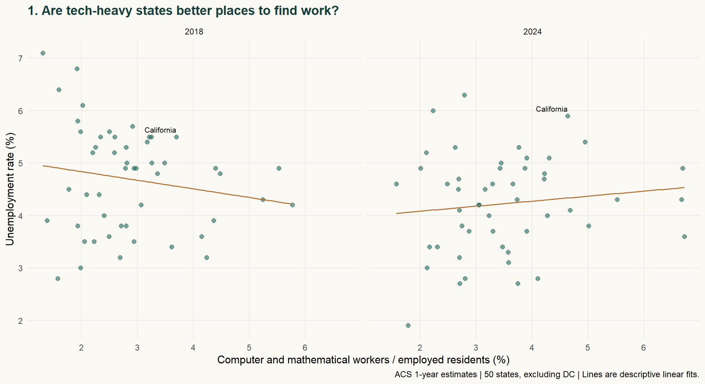
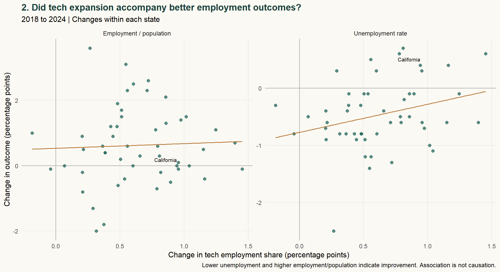
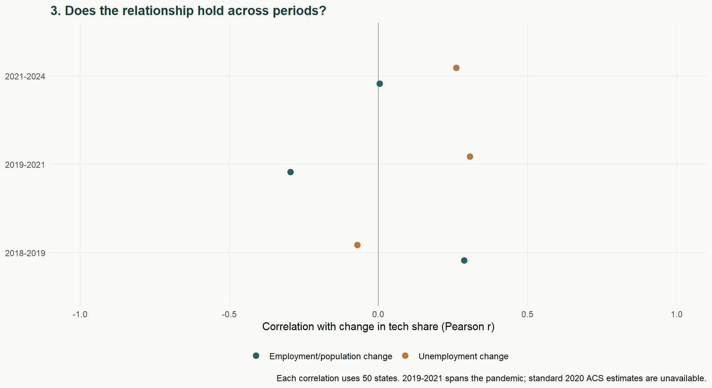
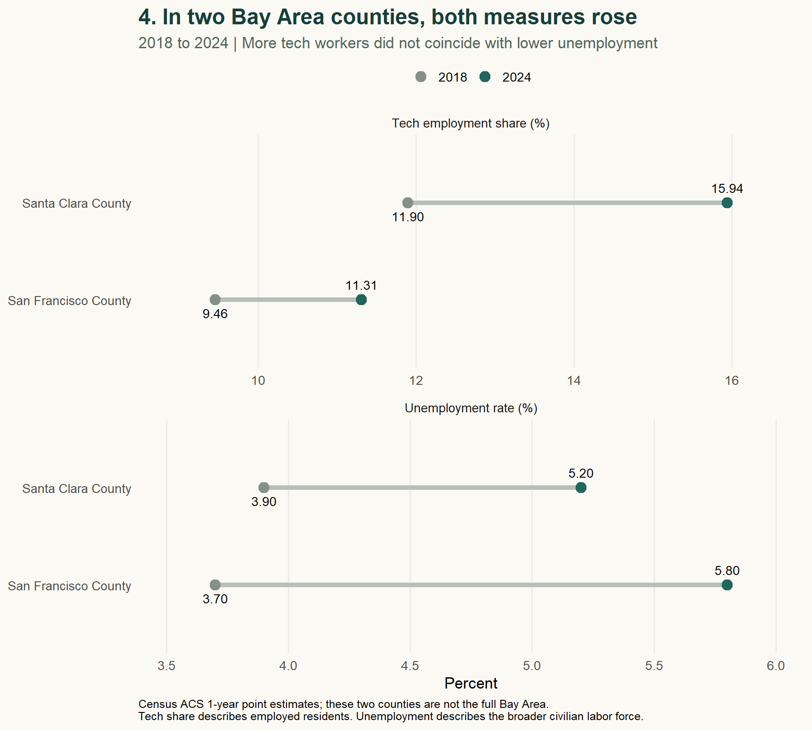
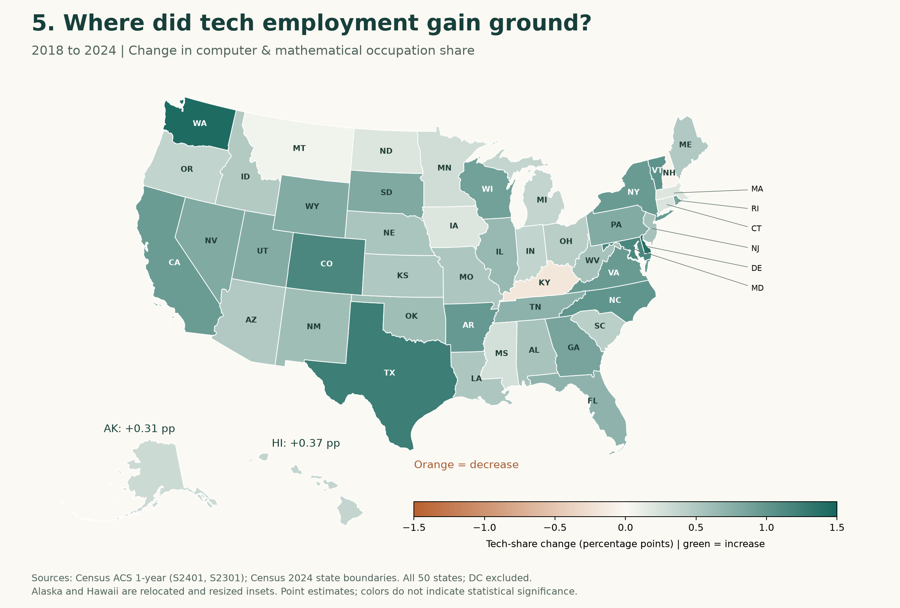
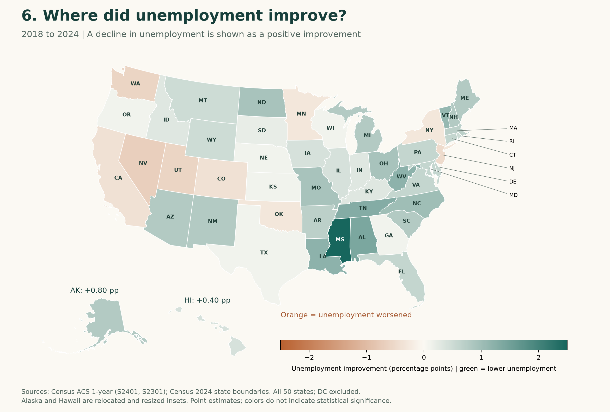

```{r}
z<-read.csv('results/state-changes.csv')
p<-read.csv('results/period-correlations.csv')
b<-read.csv('results/bay-changes.csv')
fmt<-function(x) sprintf('%.2f',x)
full<-subset(p,period=='2018-2024')
```

::: {.callout-note}
**BLOG 4 · TECHNOLOGY AND LOCAL LABOR MARKETS**

Tech employment share rose in **`r sum(z$tech_change>0)` of 50 states** between 2018 and 2024. That expansion did not come with a consistent improvement in broader employment outcomes.
:::

## A promising industry, a harder question

If a state becomes more technology-oriented, should it become an easier place to find work? That was my starting question. The Bay Area makes the question especially interesting: a place can be associated with technological opportunity without every resident sharing the same employment prospects.

I compare all 50 states across six available years, then zoom in on San Francisco and Santa Clara counties. The question is about **changes within places**, not simply which places have the most tech workers. I do not assume that technology either creates or destroys jobs.

## Measure what the data actually observe

The source is the Census Bureau's American Community Survey (ACS) **1-year estimates**, tables S2401 and S2301. I define tech concentration as the share of employed residents age 16 and older in **computer and mathematical occupations**. This transparent proxy captures an occupational mix—not technological sophistication, patents, all STEM work, or AI adoption.

Two outcomes describe the wider labor market: unemployment and the employment/population ratio. Lower unemployment is encouraging, but it can also reflect people leaving the labor force; a higher employment/population ratio provides a complementary perspective.

The panel covers 2018, 2019, and 2021–2024: **300 state-year observations**, plus 12 county-year observations. DC is retained in the download but excluded from the 50-state comparisons. I start after the 2018 occupation-classification revision and omit 2020 because Census did not release standard 1-year estimates. Each state receives equal weight; published ACS estimates already use survey weights.

## Where did tech employment expand?

Figure 1 ranks the ten states with the largest increases in tech employment share. Washington, Delaware and Texas lead this comparison. The broader shift was widespread: 48 of 50 states recorded an increase. This establishes where the occupational mix changed, but says nothing yet about whether employment conditions improved.

{fig-alt="Horizontal bars rank the top ten states by technology occupation share growth. Washington, Delaware and Texas have the largest increases."}

## Follow the changes

Figure 2 subtracts each state's 2018 value from its 2024 value. A one-point increase means, for example, moving from 3% to 4% tech employment—not a 1% increase in the number of tech workers.

Both panels make **up mean improvement**: falling unemployment in the first, rising employment/population in the second. Green marks improvement; peach marks deterioration. If more tech consistently meant better outcomes, the dots would slope upward. They do not: the correlation with unemployment improvement is **−0.29**, while employment/population improvement is nearly unrelated (**+0.04**).

This is not simply California driving the pattern: excluding it gives correlations of **−0.27** and **+0.05**, respectively. Rank correlations also preserve the broad interpretation. I checked the denominator, too: every state with a rising tech share also had an increase in its estimated number of tech workers. Their shares did not rise solely because other employment contracted.

{fig-alt="Tech share growth versus improvements in unemployment and employment/population. Green means improvement, peach means deterioration; up means better in both panels."}

## Timing changes the story

Figure 3 compares the **13 fastest-growing and 13 slowest-growing states**, ranked by tech-share change separately in each period. The bars show average employment improvements, not abstract correlation coefficients.

In 2018–2019, the faster-tech group improved more on both measures. In 2019–2021 it deteriorated more. During 2021–2024, unemployment fell **1.24 points** in the faster-tech group versus **1.70** in the slower group, while employment/population gains were similar (**1.80 versus 1.72 points**). Faster tech growth did not bring a consistent advantage.

Groups change across periods; these are equal-weight descriptive averages, not matched comparisons. Periods also differ in length. The 2019–2021 interval spans the pandemic and cannot isolate its initial shock.

{fig-alt="Grouped bars show mean improvements for the 13 fastest and 13 slowest tech-share growth states in each period. Faster growth performs better before the pandemic, worse in 2019–2021, and has mixed results in 2021–2024."}

## The Bay Area is a case, not the national answer

Santa Clara County's tech share rose from **11.90% to 15.94%**, while its ACS unemployment rate rose from **3.9% to 5.2%**. San Francisco County also recorded increases in both. These fixed county boundaries offer a local comparison without treating California as the Bay Area; the two counties do not represent the full nine-county region.

{fig-alt="Connected endpoint dots label 2018 and 2024 values for Santa Clara and San Francisco counties, showing increases in both technology occupation share and unemployment."}

## Put the changes on the map

The maps add a geographic view of the same 50-state comparison. Washington and Texas show relatively large tech-share gains, but their unemployment outcomes differ. California also gains tech share while its unemployment rate rises. The two patterns do not line up into a simple geography of technology-led improvement.

{fig-alt="United States state map of tech employment share changes. Green denotes increases, orange decreases; Alaska and Hawaii appear as labeled insets."}

{fig-alt="United States map of unemployment improvement, calculated as the 2018 rate minus the 2024 rate. Green means lower unemployment and orange means higher unemployment, with Alaska and Hawaii insets."}

Read each legend separately: the color scales differ because the measures have different ranges. Large states occupy more space, not more statistical weight. Boundaries come from the [Census 2024 cartographic boundary files](https://www2.census.gov/geo/tiger/GENZ2024/shp/); state FIPS codes link geography to the analysis.

## What this changes about my starting question

Growing tech employment is not a reliable shorthand for a stronger overall labor market. It describes which jobs residents hold, while unemployment describes a broader population.

These are descriptive associations, not causal effects. Migration, age structure, education, other industries and common shocks may influence both variables. ACS sampling error also matters, especially for counties and small changes; the download retains published margins of error, but the charts show point estimates and make no significance claims. Residence-based estimates—including remote workers—do not measure jobs located in local offices.

## Sources and replication

[Census ACS API](https://www.census.gov/programs-surveys/acs/data/data-via-api.html): S2401 occupation counts and S2301 employment indicators; [2018 comparability guidance](https://www.census.gov/programs-surveys/acs/guidance/comparing-acs-data/2018.html); [2020 release limitation](https://www.census.gov/data/developers/data-sets/acs-1year/2020.html). Data retrieved October 4, 2026. ACS rates are not interchangeable with the monthly BLS headline unemployment series.

[Download the reproducibility package](research.zip): source responses, analysis scripts, figures and README. No API key is included.

